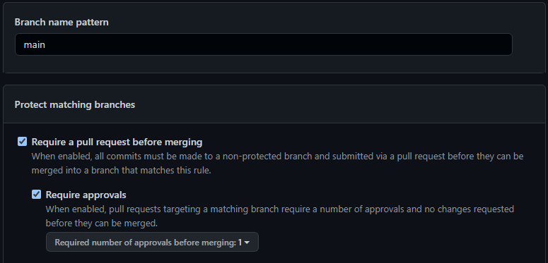
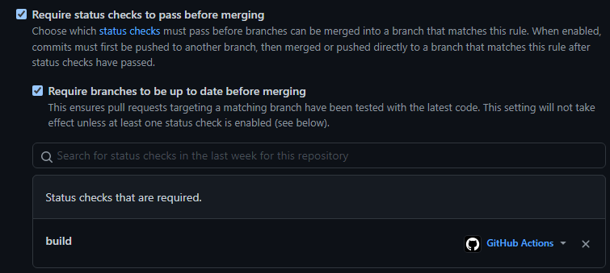
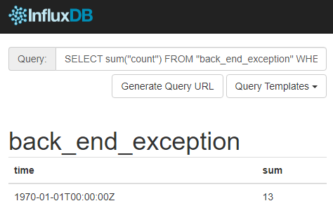
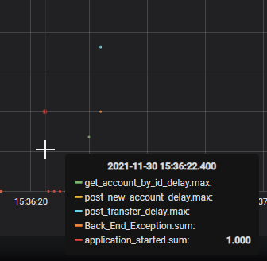
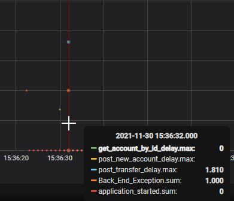
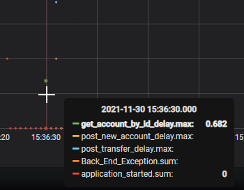
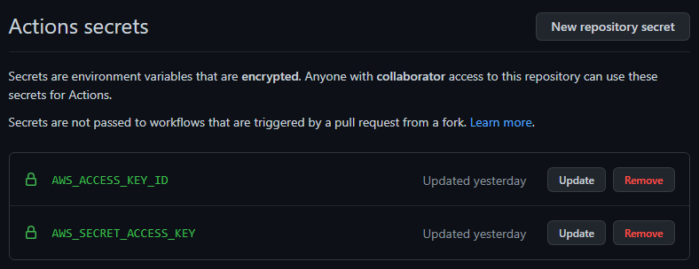

# PGR301 DevOps Eksamen, Høst 2021, Høyskolen Kristiania

Kandidatnummer: 2017
Alle oppgaver er fullført slik jeg tolket dem

## Oppgave – DevOps
- *Beskriv med ord eller skjermbilder hvordan man kan konfigurere GitHub på en måte som gir bedre kontroll på utviklingsprosessen. Spesielt med tanke på å hindre kode som ikke kompilerer og feilende tester fra å bli integrert i main branch.*
- *Beskriv med ord eller skjermbilder hvordan GitHub kan konfigureres for å sikre at minst ett annet medlem av teamet har godkjent en pull request før den merges.*
- *Beskriv hvordan arbeidsflyten for hver enkelt utvikler bør være for å få en effektiv som mulig utviklingsprosess, spesielt hvordan hver enkelt utvikler bør jobbe med Brancher i GitHub hver gang han eller hun starter en ny oppgave.*

For å få god kontroll på arbeidsprosessen kan man sette opp «Branch protection rules», i `Settings -> Branches -> Add Rule`. «Require a pull request before merging» betyr at man ikke kan pushe rett til main, men at man må gå gjennom en annen branch og så lage pull requests. Man kan sikre at andre medlemmer har godkjent pull requesten ved å velge «Require approvals».  
NB: Man må også velge «Include administrators» om det skal gjelde for absolutt alle. 

For å forhindre at man får feilende tester i main branchen, kan man sette opp å kreve status checks før man merger. I bildet under er det valgt at «build» is Github Actions skal bli godkjent før man kan merge en pull request. I eksempelet her vil koden prøve å bygge en JAR med  `mvn -B package –file pom.xml`. Om det feiler, kan man ikke merge. Man kan også kun kjøre tester, f.eks. `npm test` i et prosjekt som bruker npm, f.eks. en nettside i React.

For å få en effektiv arbeidsflyt, burde nye oppgaver ha egne branches, som igjen er navngitt med beskrivende navn. Man kan også knytte mulige github issues opp mot branch ved å bruke github issues ID i navnet på branchen. Her kan forskjellige firmaer ha forskjellige konvensjoner på hvordan de navngir branches, men et eksempel vil være «feature/feature-pomchange». Ikke «fix-new-test».  
Her er det viktig at man ikke går utover det branchen er ment for. En branch som er for en spesifikk type test skal plutselig ikke inneholde 3 andre ting når man gjør pull request. Man må begrense oppgavestørrelse for å opprettholde god flow.

*Drøft: SkalBank har bestemt seg for å bruke DevOps som underliggende prinsipp for all systemutvikling i banken. Er fordeling av oppgaver mellom API-teamet og «Team Dino» problematisk med dette som utgangspunkt? Hvilke prinsipper er det som ikke etterleves her? Hva er i så fall konsekvensen av dette?*

Måten utvikler-teamet alle pusher til main kontinuerlig, uten å hverken bygge eller teste koden, skaper flere problemer for flyten. Det bryter med *VCS* og *Kontinuerlig integrasjon*, og kan skape mye *Waste* på flere måter. Det kan også resultere i at arbeid ikke er veldig synlig, oppgavestørrelser kan bli for store og man har liten oversikt over «WIP» (Work in progress).

- Om to utviklere jobber på forskjellige ting, kan det hende de forårsaker defekter for hverandre. Plutselig fungerer ikke koden til utvikler A fordi utvikler B har gjort en endring et sted. Da må begge «context switche» for å løse problemet.
- Uten god planlegging blir det fort venting på andre features når man skal legge inn nye ting, om det avhenger av hverandre. Om man skal bruke et eksisterende endepunkt som mangler dokumentasjon, man må ta tak i en annen utvikler og skape avbrudd i dens arbeid for å få informasjonen man trenger
- Liten oversikt over oppgavestørrelser fører til liten oversikt over «WIP». Plutselig kan en ny og ung utvikler gjøre noe kjempestort for å vise seg frem som flink og motivert, men dette kan gå utenfor scope og til slutt være arbeid man må forkaste.
- Overlevering av ny JAR fra «Jens» til «Team Dino» hver gang det kommer en ny versjon, er problematisk. Overlevering i ‘batch’ på denne måten er mye mindre effektivt enn overlevering i en steady flow av kontinuerlige leveranser der hver nye feature kommer til «Team Dino» med en gang etter merge til main branch. Dette er en typisk flaskehals.
- Spesielt når majoriteten av de ansatte er avhengig av en ny versjon for å teste, vil det bli waste i stor grad om det ikke kommer noen ny versjon. Da vil størsteparten av «Team Dino» sitte uten noe å gjøre. 

Det er klart at man må endre fra overleveringer fra ‘batch’ til å bli en kontinuerlig flyt. Mer planlegging og oversikt hvor hva som gjøres.  

Måten «Team Dino» kun gjør manuelle tester før de setter den nye versjonen i drift, vil i stor grad skape venting og være enda en overlevering som kan automatiseres i stor grad. Fordelingen kan endres så flere ansatte blir flyttet fra «Team Dino» over til utvikler-teamet, men beholder fokus på testing. De vil jobbe med å utvikle automatiske tester som må godkjennes før koden i det hele tatt kommer til «Team Dino», slik forklart tidligere med «Branch protection rules».  

«Team Dino» sin overvåkning dekker ikke prinsippene om feedback. Resultatet er faktaløs «blamestorming». Det skal ikke trenge å gjøre omstart av applikasjonen hver dag. Løsningen her er å implementere logging og telemetri, slik at man kan lokalisere og fikse feil over å ansette nye til å gjøre manuell testing.

## Oppgave – Feedback

Siden det lå en Logback.xml i repository, tok jeg dette som et hint på å bruke Logger til tross for at
det ikke står nevnt i oppgaveteksten. Det er også lagt inn målepunkter for micrometer.

Micrometer er satt opp slik som gjort i veiledningstime, med Grafana og Influxdb kjørende i docker.
Alle endepunkter har egne måling for hvor lang tid de tar.

Navn på målinger fra micrometer:
- `application_started` – viser når man har startet applikasjonen. Dette vil gi en oversikt over hvor ofte «Team Dino» har startet prosessen på nytt.
- `post_transfer_delay` – viser hvor lang tid det tok å kalle på endepunktet for overføring.
- `post_new_account_delay` – viser hvor lang tid det tok å kalle på endepunktet for å lage en ny eller oppdatere en eksisterende konto. Inneholder samme info som post_transfer_delay også.
- `get_account_by_id_delay` – viser hvor lang tid det tok å kalle på endepunktet for å få info om en konto. Har også samme målinger som post_transfer_delay.
- `back_end_exception` – en delles metric som logges for alle endpoints som kalles. Her kan man bruke en spørring for å få antall exceptions; `SELECT sum("count") FROM "Back_End_Exception" WHERE ("exception" = 'BackEndException')`.
- `application_started` – se når application er startet. Det er også en logger info for dette.
- `transfer` – info om hvor mye som blir øverført.
- `update_account` – når man kaller på updateAccount.
- `balance` – når man kaller på å få info om en konto
- `account_balance` – den faktiske balansen på en konto.

For å se målinger kan sensor kjøre f.eks. `select * from get_account_by_id_delay`. Her vil man kunne se info om @timer tilknyttet et endepunkt. Bl.a info om statuskode, uri, om det er GET eller POST og info om hvilken exception som mulig kalles.

Bilde av kall for å få BackEndExceptions, som nevnt litt over:

Man kan se når applikasjonen har startet:  

POST kall for transfer som gir back end exception:  

GET account by id som ikke ender I noe exception:  

Logger er satt opp til å vise når man starer applikasjonen og for å vise balansen til kontoen man
sender penger til i transfer, både før og etter transfer skjer.  
Logback.xml er endre til å også vise «info» til STDOUT, noe som hjelper med å vise hvorfor det er
delay; `24270 [http-nio-8080-exec-1] INFO c.p.e.ReallyShakyBankingCoreSystemService - Waiitng
for 4268`.

## Oppgaver Terraform
*Drøft: Hvorfor funket terraform koden i dette repoet for «Jens» første gang det ble kjørt? Og hvorfor feiler det for alle andre etterpå, inkludert Jens etter at han har ryddet på disken sin og slettet terraform.tfstate filen?*

Terraform-koden til Jens oppretter en S3-bucket. En tfstate-fil inneholder informasjon om infrastrukturen som er bygd ved hjelp av Terraform. Første gang Jens kjørte `terraform apply`, bygde den hans S3-bucket og lagret informasjonen om dette i hans terraform-tfstate fil. Om Jens ville kjørt koden igjen uten å slette tfstate-filen, ville tfstate-filen visst hva som fantes i infrastrukturen fra forrige gang, slik at Terraform vet hva som mulig skal endres. Men siden Jens slettet tfstate-filen, vil Terraform tro at det ikke finnes noen infrastruktur på AWS, og dermed prøve å opprette fra scratch, noe som feiler fordi S3 bucketen som han opprettet første gang han kjørte koden, fortsatt ligger der. Det samme vil skje for alle de andre – deres Terraform vil tro at det ikke finnes noen infrastruktur, siden de ikke har noen tfstate fil, og få feilmelding fordi de prøver å opprette en bucket som allerede finnes.  
For å løse dette kan de slette S3-bucketen og opprette den på nytt ved å kjøre `terraform apply` igjen. Da vil de få en ny tfstate fil som de så må ta vare på og heller dele mellom seg. Dette kan selvsagt være litt tungvint, så en bedre løsning vil være å lagre den i en cloud-tjeneste som terraform.io, eller AWS S3 som vi viser senere i denne oppgaven.

#### AWS CLI

*Sensor ønsker å lage sin egen bucket ved hjelp av CLI. Sensor har AWS kommandolinje installer på sin lokale maskin. Hva må sensor gjøre for å konfigurere AWS nøkler/Credentials? Anta at sensor sin AWS bruker ikke har nøkler/credentials fra før.*

Det første sensor må gjøre er å autentisere seg mot AWS ved hjelp av nøkler som er knyttet til brukerkontoen. Det trengs to nøkler; en Access Key og en Secret Access Key. Disse finner man I AWS brukergrensesnittet; `IAM -> Security Credentials -> Access keys for CLI, SDK, & API access -> Create Access Key`.  
For å autentisere seg kjører man kommandoen `aws configure` i AWS CLI. Man fyller inn Access Key og Secret Access Key når man blir bedt om det, velger region eu-west-1 som default region name, og på output format kan det anbefales å velge json.    
For å opprette en ny bucket fra CLI må sensor skrive: `aws s3api create-bucket --bucket pgr301-sensor123-terraform --create-bucket-configuration LocationConstraint=eu-west-1`. Merk at `pgr301-sensor123-terraform` her er navnet på bucketen, og er valgfritt.

## Terraform i Pipeline
- For enhetstester står det at de kun skal kjøre ved push til main, men dette fjerner litt av poenget med ‘branch protection’, så jeg har valg å tolke dette som en feil i oppgaven og har derfor satt opp workflow for dette til å også kjøre ved pull request.
- Terraform Plan kjøres kun når det gjøres pull requests mot master branch.
- Terraform apply kjøres kun når det pushes til master branch.
- Pipelinen feiler dersom Terraform ikke er formatert riktig.
- Det blir ikke gjort noen faktiske endringer om det ikke er endring på koden i infra-mappen.

*Beskriv hva sensor må gjøre etter han/hun har laget en fork for å få pipeline til å fungere for i sin AWS/gitHub konto. Hvilke verdier må endres i koden? Hvilke hemmeligheter må legges inn i repoet. Hvordan gjøres dette?*

- Sensor må legge til det som kalles ‘secrets’ i github-repository. Dette er de samme nøklene som man brukte tidligere for å autentisere seg i AWS CLI (`IAM -> Security Credentials -> Access keys for CLI, SDK, & API access -> Create Access Key`), og gjør at GitHub kan autentisere seg mot AWS på samme måte som AWS CLI. I github-repositoriet, velg `Settings -> Secrets -> New repository secret`. Name er navnet på nøkkelen, mens i Value skal man skrive inn selve nøkkelen. Under er også vedlagt et screenshot av hvordan det skal se ut.
  - Name: `AWS_ACCESS_KEY_ID`, Value: nøkkelen fra “Access key ID”.
  - Name: `AWS_SECRET_ACCESS_KEY`, Value: nøkkelen fra “Secret access key”.

    

Ting som må endres i koden:  
Merk at master/main er begge navn på hoved-branchen. Jeg har brukt ‘master’ fordi det var default ved opprettelse av repositoriet. Om man kun kjører en fork vil man ikke trenge å endre dette, men jeg legger allikevel ved info om hvor man må endre dette, om man f.eks. laster ned ZIP fil og deler det i et nytt repository der man bruker ‘main’.
- `/.github/workflows/create_image.yaml` – Her må man mulig endre ‘master’ til ‘main’ på linje 6. Man må også endre URL til ECR repository på linje 20 og AWS username på linje 23. Linje 24 er navn på Docker imaget, f.eks. pgr301kaam004eksamen.
- `/.github/workflows/s3_terraform.yaml` – Her må man mulig endre ‘master’ til ‘main’ på linje 4, 6 og 75.
- `/.github/workflows/verify_tests.yaml` – Her må man mulig endre ‘master’ til ‘main’ på linje 5 og 7.
- `/infra/ecr_repository.tf` – Linje 2, endre «kaam004» til det sensor ønsker å kalle sitt ECR repository, f.eks. «sensor123».
- `/infra/provider.tf` – Linje 9 er navnet på S3 bucketen man oppretter, og må endres til f.eks. «pge301-sensor123-terraform». Linje 10 må i teorien ikke endres, men det kan anbefales å endre til f.eks. «pgr301-sensor123-terraform.state», eller bare «terraform.state». Det er ikke nødvendig med en unik identifikator på state-filen slik jeg har gjort.

## Oppgave - Docker

- Workflowen (create_image.yaml) kjører kun ved push til master.
- Om man prøver å omgå 'branch protection' fordi man har feilende tester, vil workflowen feile og ikke fullføre push til ECR.
- Alle container-images har unik tag som identifiserer hvilken github commit som ble brukt som grunnlag. Det er også en latest-tag.
- ECR repository er det samme som lages automatisk av terraform.

*Hva vil kommandolinjer for å bygge et container image være?*  
`docker build . -t containerimage`  

*Hva vil kommando for å starte en container være? Applikasjonen skal lytte på port 7777 på din maskin.*  
`docker run -p 7777:8080 containerimage`  
Merk at «containerimage» er navnet på imaget. Her burde man ha et litt mer beskrivende navn. I min besvarelse har jeg brukt «pgr301kaam004eksamen». Man kan også spesifisere tag når man builder eller kjører, ved å legge på :tag etter containerimage, f.eks.; «pgr301kaam004eksamen:latest».

*Medlemmer av «Team Dino» har av og til behov for å kjøre to ulike versjoner av applikasjonen lokalt på maskinen sin, samtidig. Hvordan kan de gjøre dette uten å få port-konflikt? Hvilke to kommandoer kan man kjøre for å starte samme applikasjon to ganger, hvor den ene bruker port 7777 og den andre 8888?*  
Man må bare kjøre den samme run kommandoen to ganger, der man endrer hvilken port docker
lytter på mot maskinen.  
`docker run -p 7777:8080 containerimage`  
`docker run -p 8888:8080 containerimage`  