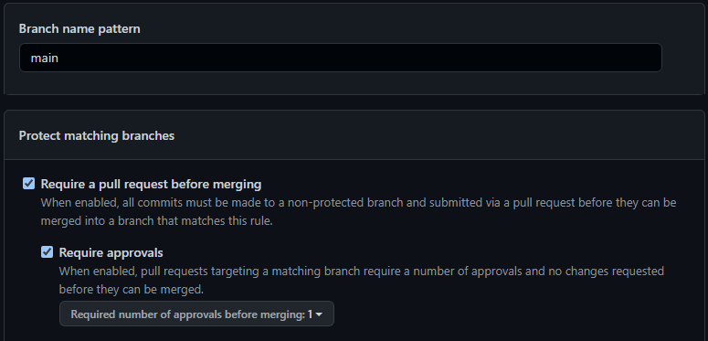
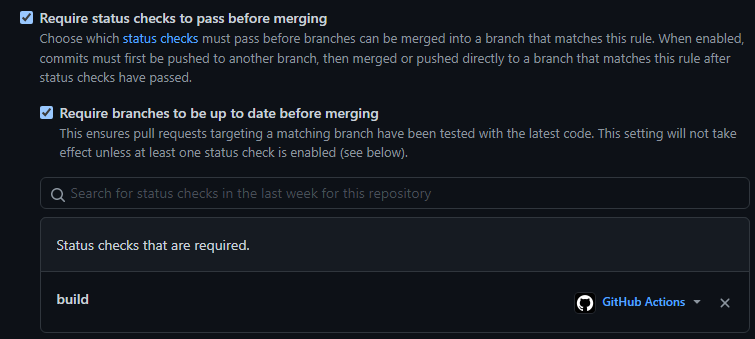
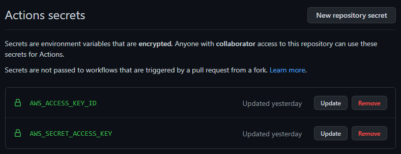

# Eksamen PGR301

## Oppgave – DevOps
- *Beskriv med ord eller skjermbilder hvordan man kan konfigurere GitHub på en måte som gir bedre kontroll på utviklingsprosessen. Spesielt med tanke på å hindre kode som ikke kompilerer og feilende tester fra å bli integrert i main branch.*
- *Beskriv med ord eller skjermbilder hvordan GitHub kan konfigureres for å sikre at minst ett annet medlem av teamet har godkjent en pull request før den merges.*
- *Beskriv hvordan arbeidsflyten for hver enkelt utvikler bør være for å få en effektiv som mulig utviklingsprosess, spesielt hvordan hver enkelt utvikler bør jobbe med Brancher i GitHub hver gang han eller hun starter en ny oppgave.*

For å få god kontroll på arbeidsprosessen kan man sette opp «Branch protection rules», i `Settings -> Branches -> Add Rule`. «Require a pull request before merging» betyr at man ikke kan pushe rett til main, men at man må gå gjennom en annen branch og så lage pull requests. Man kan sikre at andre medlemmer har godkjent pull requesten ved å velge «Require approvals».  
NB: Man må også velge «Include administrators» om det skal gjelde for absolutt alle. 

For å forhindre at man får feilende tester i main branchen, kan man sette opp å kreve status checks før man merger. I bildet under er det valgt at «build» is Github Actions skal bli godkjent før man kan merge en pull request. I eksempelet her vil koden prøve å builde en JAR med `mvn -B package –file pom.xml`. Om det failer, kan man ikke merge. Man kunne også kun kjørt tests, f.eks `npm test` i et prosjekt som bruker npm, f.eks en nettside i React

For å få en effektiv arbeidsflyt, burde nye oppgaver ha egne branches, som igjen er navngitt med beskrivende navn. Man kan også knytte potensielle github issues opp mot branch ved å bruke github issues ID i navnet på branchen. Her kan forskjellige firmaer ha forskjellige konvensjoner på hvordan de navngir branches, men et eksempel vil være «tests/added-tests-to-cover-doSomething/issueID». Ikke «fix-new-test».

#### Drøft:
*SkalBank har bestemt seg for å bruke DevOps som underliggende prinsipp for all systemutvikling i banken. Er fordeling av oppgaver mellom API-teamet og «Team Dino» problematisk med dette som utgangspunkt? Hvilke prinsipper er det som ikke etterleves her? Hva er i så fall konsekvensen av dette?*

**TODO: Her trenger vi litt drøfting**

## Oppgave – Feedback

**TODO: Skjermbilde av dashboard i grafana (og influxdb?), og kanskje noe tekst om det osv osv**

## Oppgaver Terraform
*Drøft: Hvorfor funket terraform koden i dette repoet for «Jens» første gang det ble kjørt? Og hvorfor feiler det for alle andre etterpå, inkludert Jens etter at han har ryddet på disken sin og slettet terraform.tfstate filen?*

Terraform-koden til Jens oppretter en S3-bucket. En tfstate-fil inneholder informasjon om infrastrukturen som er bygd ved hjelp av Terraform. Første gang Jens kjørte `terraform apply`, bygde den hans S3-bucket og lagret informasjonen om dette i hans terraform-tfstate fil. Om Jens ville kjørt koden igjen uten å slette tfstate-filen, ville tfstate-filen visst hva som fantes i infrastrukturen fra forrige gang, slik at Terraform vet hva som mulig skal endres. Men siden Jens slettet tfstate-filen, vil Terraform tro at det ikke finnes noen infrastruktur på AWS, og dermed prøve å opprette fra scratch, noe som feiler fordi S3 bucketen som han opprettet første gang han kjørte koden, fortsatt ligger der. Det samme vil skje for alle de andre – deres Terraform vil tro at det ikke finnes noen infrastruktur, siden de ikke har noen tfstate fil, og få feilmelding fordi de prøver å opprette en bucket som allerede finnes.  
For å løse dette kan de slette S3-bucketen og opprette den på nytt ved å kjøre `terraform apply` igjen. Da vil de få en ny tfstate fil som de så må ta vare på og heller dele mellom seg. Dette kan selvsagt være litt tungvint, så en bedre løsning vil være å lagre den i en cloud-tjeneste som terraform.io, eller AWS S3 som vi viser senere i denne oppgaven.

#### AWS CLI

*Sensor ønsker å lage sin egen bucket ved hjelp av CLI. Sensor har AWS kommandolinje installer på sin lokale maskin. Hva må sensor gjøre for å konfigurere AWS nøkler/Credentials? Anta at sensor sin AWS bruker ikke har nøkler/credentials fra før.*

Det første sensor må gjøre er å autentisere seg mot AWS ved hjelp av nøkler som er knyttet til brukerkontoen. Det trengs to nøkler; en Access Key og en Secret Access Key. Disse finner man I AWS brukergrensesnittet; `IAM -> Security Credentials -> Access keys for CLI, SDK, & API access -> Create Access Key`.  
For å autentisere seg kjører man kommandoen `aws configure` i AWS CLI. Man fyller inn Access Key og Secret Access Key når man blir bedt om det, velger region eu-west-1 som default region name, og på output format kan det anbefales å velge json.    
For å opprette en ny bucket fra CLI må sensor skrive: `aws s3api create-bucket --bucket pgr301-sensor123-terraform --create-bucket-configuration LocationConstraint=eu-west-1`. Merk at `pgr301-sensor123-terraform` her er navnet på bucketen, og er valgfritt.

## Terraform i Pipeline
- Terraform Plan kjøres kun når det gjøres pull requests mot master branch.
- Terraform apply kjøres kun når det pushes til master branch.
- Pipelinen feiler dersom Terraform ikke er formatert riktig.
- Det blir ikke gjort noen faktiske endringer om det ikke er endring på koden i infra-mappen.

*Beskriv hva sensor må gjøre etter han/hun har laget en fork for å få pipeline til å fungere for i sin AWS/gitHub konto. Hvilke verdier må endres i koden? Hvilke hemmeligheter må legges inn i repoet. Hvordan gjøres dette?*

- Sensor må legge til det som kalles ‘secrets’ i github-repository. Dette er de samme nøklene som man brukte tidligere for å autentisere seg i AWS CLI (`IAM -> Security Credentials -> Access keys for CLI, SDK, & API access -> Create Access Key`), og gjør at GitHub kan autentisere seg mot AWS på samme måte som AWS CLI. I github-repositoriet, velg `Settings -> Secrets -> New repository secret`. Name er navnet på nøkkelen, mens i Value skal man skrive inn selve nøkkelen. Under er også vedlagt et screenshot av hvordan det skal se ut.
  - Name: `AWS_ACCESS_KEY_ID`, Value: nøkkelen fra “Access key ID”.
  - Name: `AWS_SECRET_ACCESS_KEY`, Value: nøkkelen fra “Secret access key”.
    
    Ting som må endres i koden:  
    Merk at master/main er begge navn på hoved-branchen. Jeg har brukt ‘master’ fordi det var default ved opprettelse av repositoriet. Om man kun kjører en fork vil man ikke trenge å endre dette, men jeg legger allikevel ved info om hvor man må endre dette, om man f.eks. laster ned ZIP fil og deler det i et nytt repository der man bruker ‘main’.
- `/.github/workflows/create_image.yaml` – Her må man mulig endre ‘master’ til ‘main’ på linje 6. Man må også endre URL til ECR repository på linje 20 og AWS username på linje 23. Linje 24 er navn på Docker imaget, f.eks. pgr301kaam004eksamen.
- `/.github/workflows/s3_terraform.yaml` – Her må man mulig endre ‘master’ til ‘main’ på linje 4, 6 og 75.
- `/.github/workflows/verify_tests.yaml` – Her må man mulig endre ‘master’ til ‘main’ på linje 5 og 7.
- `/infra/ecr_repository.tf` – Linje 2, endre «kaam004» til det sensor ønsker å kalle sitt ECR repository, f.eks. «sensor123».
- `/infra/provider.tf` – Linje 9 er navnet på S3 bucketen man oppretter, og må endres til f.eks. «pge301-sensor123-terraform». Linje 10 må i teorien ikke endres, men det kan anbefales å endre til f.eks. «pgr301-sensor123-terraform.state», eller bare «terraform.state». Det er ikke nødvendig med en unik identifikator på state-filen slik jeg har gjort.

## Oppgave - Docker

- Workflowen (create_image.yaml) kjører kun ved push til master.
- Alle container-images har unik tag som identifiserer hvilken github commit som ble brukt som grunnlag. Det er også en latest-tag.
- ECR repository er det samme som lages automatisk av terraform.

*Hva vil kommandolinjer for å bygge et container image være?*  
`docker build . -t containerimage`  

*Hva vil kommando for å starte en container være? Applikasjonen skal lytte på port 7777 på din maskin.*  
`docker run -p 7777:8080 containerimage`  
Merk at «containerimage» er navnet på imaget. Her burde man ha et litt mer beskrivende navn. I min besvarelse har jeg brukt «pgr301kaam004eksamen». Man kan også spesifisere tag når man builder eller kjører, ved å legge på :tag etter containerimage, f.eks.; «pgr301kaam004eksamen:latest».

*Medlemmer av «Team Dino» har av og til behov for å kjøre to ulike versjoner av applikasjonen lokalt på maskinen sin, samtidig. Hvordan kan de gjøre dette uten å få port-konflikt? Hvilke to kommandoer kan man kjøre for å starte samme applikasjon to ganger, hvor den ene bruker port 7777 og den andre 8888?*  
Man må bare kjøre den samme run kommandoen to ganger, der man endrer hvilken port docker
lytter på mot maskinen.  
`docker run -p 7777:8080 containerimage`  
`docker run -p 8888:8080 containerimage`  